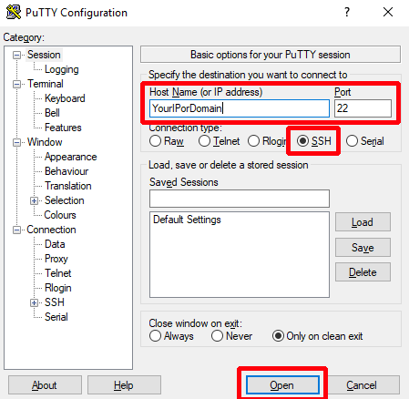

# P4Install - Post setup configuration for Unreal Engine 4 projctes
**Work in progress  may not yet work flawlessly - please search the issues or create a new one if you experience a problem**

After you have installed Perforce Helix and setup your users, you are ready to go.. But wait.. there is more to it.
If you want to use your perforce server mainly for Unreal Engine 4 projects, you should properly setup .p4ignore file(s) and typemap(s).
This makes it way easier if you want do have a hassle and pain free experience (Believe me.. I learned it the hard way).

## Step-by-step configuration guide
### 0. Prerequisites
 - Server IP address
 - Password for the root user (and username if not root)
 - Username and password of your Perforce superuser
 - PuTTY https://www.putty.org
 - Helix Core Apps
	- P4V
	- P4 (Command Line Interface)

### 1. Connect to server
 - Start PuTTY
 - Fill in your servers IP address, port should be 22 (ssh default port) but there is a possibility it needs to be changed (should be provided by server provider if different. In home server or NAS setups it depends on your port forwarding rules)
 - Sign-in as a user with root privileges



### 2. Setup P4 Typemap
The Typemap tells perforce how it should handle different file types. This is important so perforce (as an example) does not lock dll files and prevent you from building your project when using C++.

```
    wget public-URL-to-TypeMapScript
    chmod +x PerforceTypemap.sh
    ./PerforceTypemap.sh

```

Follow the instructions given by the script. Important information is written in red.

### 3. Setup Perforce ignore file
You can now close PuTTY. You will not need it any longer in this guide.

Before you add a Project to your depot, make sure to add a ignore file.
If you do not want to research about p4ignore files yourself, feel free to download this [.p4ignore file](.p4ignore).
It should be suitable for most projects, but do not take it for granted.

If you place the .p4ignore file inside a folder it will only affect this folder.

It would be nice if we did not have to use a command line interface for once, but unfortunately we need to make sure perforce actually uses the .p4ignore file(s).

Start your CMD or terminal and enter the following:

```
	p4 set P4IGNORE=.p4ignore

```
**Every user has to run the above command on every machine he uses.**
If this is not enough to please you, take a look at https://www.perforce.com/manuals/p4sag/Content/P4SAG/protections.set.html

You can do the same as inside a p4ignore file, but on the server instead of each client.
I might add a shell script at a later time.

### 4. Enjoy
Have fun :)
